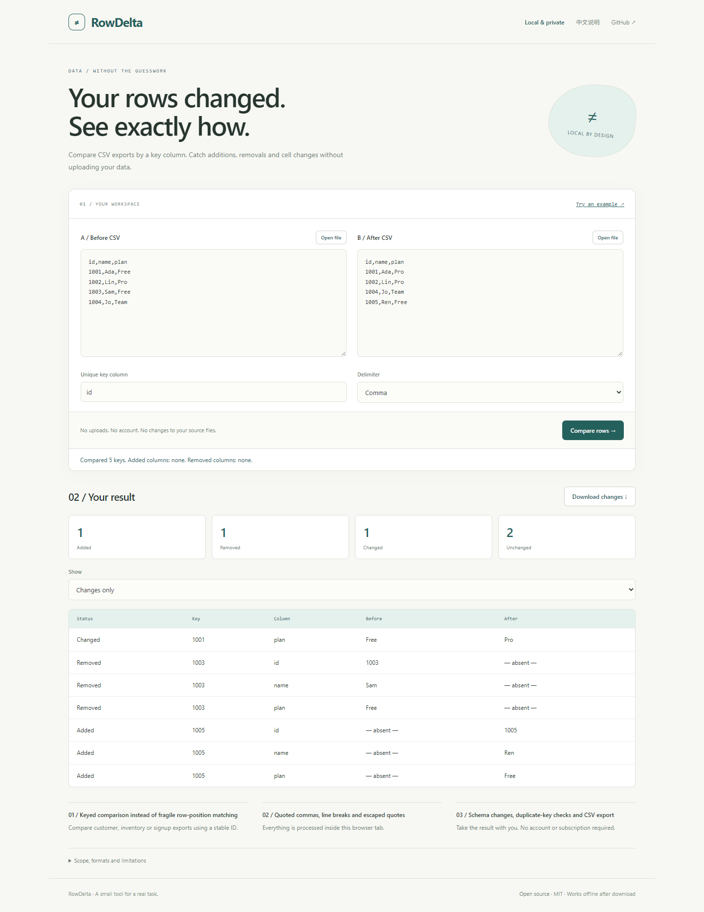

# RowDelta

**Your rows changed. See exactly how.**

Compare CSV exports by a key column. Catch additions, removals and cell changes without uploading your data.

[Open the app](https://sq2100.com/rowdelta/) · [Download offline HTML](https://github.com/sq2100/rowdelta/releases/latest) · [简体中文](README.zh-CN.md)



## Why use it?

Compare customer, inventory or signup exports using a stable ID.

- Keyed comparison instead of fragile row-position matching
- Quoted commas, line breaks and escaped quotes
- Schema changes, duplicate-key checks and CSV export

No uploads, account, API key, tracking scripts, or runtime CDN dependencies. The built app is a single HTML file. Source files are never modified.

## Quick start

Open the [hosted app](https://sq2100.com/rowdelta/) and click **Try an example**. Or download the HTML from [Releases](https://github.com/sq2100/rowdelta/releases/latest), then open it in a modern desktop browser.

To build from source (Node.js 20.19+):

```sh
npm ci
npm test
npm run build
```

Open `dist/index.html`, or run `npm start` for a local preview at http://127.0.0.1:4178. Set the `PORT` environment variable to run multiple projects simultaneously.

## Scope and limitations

CSV and TSV only; UTF-8 file imports up to 5 MiB each. Compares values as exact strings, including whitespace. Empty physical lines are ignored. A key must be nonempty and unique in both files; duplicate keys stop the comparison. XLSX, formulas, fuzzy matching and compound keys are not supported. Missing columns differ from empty cells. The screen shows the first 500 rows; exports include every change. Spreadsheet formula-like cells are prefixed with an apostrophe in CSV reports.

The initial version targets modern desktop browsers. Chromium is used for local smoke checks. Browser differences and real-world data may reveal additional edge cases; please report reproducible problems with synthetic examples. No guarantee of suitability for every input is made.

## Privacy

The app processes data in memory and has no application server, analytics, cookies, local storage or external runtime resources. A Content Security Policy blocks network connections and external scripts. User data is rendered as text, except for the intentionally previewed local images and validated colors.

The hosting provider receives normal page-request metadata (such as IP addresses). Download the HTML and open it offline for disconnected work. Exported files may contain your data. Browser extensions, the operating system and a modified hosted copy are outside this app's control.

## Development

Plain JavaScript, browser APIs, Node’s built-in test runner, and esbuild. Core logic lives in `src/core.js`; UI behavior is in `src/app.js`. Run `npm run format` before sending changes. GitHub Actions tests and builds each push; the separate Pages workflow publishes the demo when run manually.

[Contributing](CONTRIBUTING.md) · [Security](SECURITY.md) · [MIT license](LICENSE)
